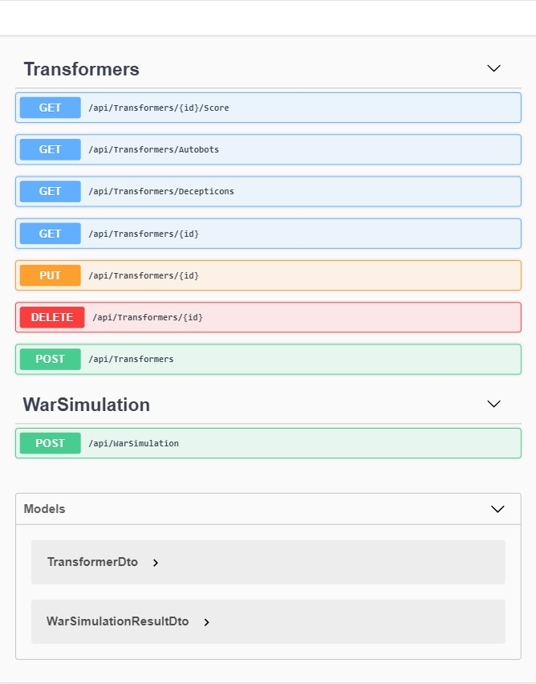

# MultiWorld API

MulitWorld is a war simulation game played between Transformer groups Autobots and Decepticons to decide the winning side without actually going to war with each other. This project builds an API to play the game.

### Open source libraries used
- `Swagger` for API documentation
- `NUnit` and `Moq` for testing

### Before running
- Prepare Dev environment by installing : `Windows 10`, `SQL Server 2017 Developer Edition`, `Visual Studio 2017 Community Edition`, `DotNet Core 2.2`
- Entity Framework Code-First creates a database named `multi-world-db` in the local SQL Server using logged-in Windows user credentials. Make sure there are no existing DB of the same name before running the application and that the logged-in Windows user has sufficient permissions. Otherwise switch to a different DB name/credentials by editing the connection string in `MultiWorld\appsettings.json`.

### How to run
- Clone project from Github. This should create a folder named `MultiWorld`.
- From the `MultiWorld` folder, open solution file `MultiWorld.sln` in Visual Studio.
- In Visul Studio, open `Tools --> Nuget Package Manager --> Package Manager Console`.
- In `Package Manager Console` run `Update-Database` to create the DB schema using EF.
- In Visul Studio, hit `F5` or `Debug--> Start Debugging` to run the program using `IIS Express`. 
- When run, the program should open a browser window with the Swagger UI for the API.

